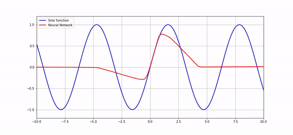

# Fitting a sine function using a Neural Network

In this repository, you will find the codes to create a neural network capable of approximate a sine function.

All the explanations and discussions about creating the model and overfittings problems it can have are in the notebook.

In the end, it is expected that you produce results as shown below:

